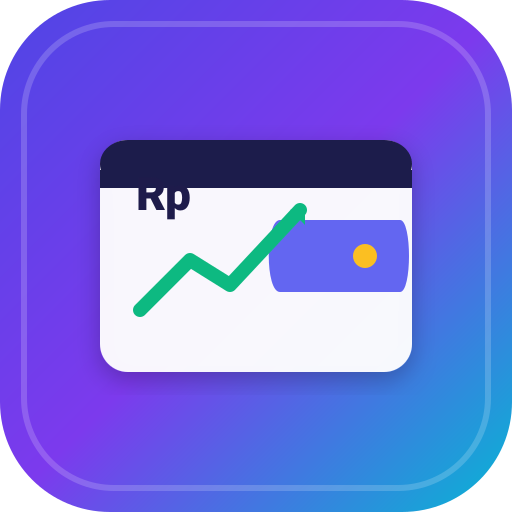

<p align="center">
  
</p>

<h1 align="center">myCost</h1>

<p align="center">
  <strong>Pengelola Keuangan Pribadi Mandiri & Pemindai Nota Pintar (OCR)</strong>
</p>

<p align="center">
  Aplikasi Manajemen Keuangan Pribadi Mandiri (<em>Self-Hosted</em>) terinspirasi dari <strong>Firefly III</strong> dengan tampilan modern <strong>Emerald Green</strong>, fitur Multi-Rekening, Anggaran Bulanan, Celengan Impian, serta Pemindai Nota Pintar (OCR) yang berjalan 100% lokal di browser Anda.
</p>

<p align="center">
  
  
  
  
  
  
  
</p>

---

## 📑 Daftar Isi

- [🌟 Fitur Utama](#-fitur-utama)
- [💻 Kebutuhan Sistem](#-kebutuhan-sistem)
- [🛠️ Panduan Instalasi](#️-panduan-instalasi)
- [🚀 Panduan Menjalankan Aplikasi](#-panduan-menjalankan-aplikasi)
  - [Cara 1: Launcher 1-Klik Windows](#cara-1-menggunakan-skrip-1-klik-rekomendasi-windows)
  - [Cara 2: Manual via Terminal](#cara-2-menjalankan-manual-via-terminal)
  - [Cara 3: Perintah Kustom Terminal (`cost` & `stopcost`)](#cara-3-membuat-perintah-kustom-terminal-cost--stopcost)
- [📱 Akses dari Smartphone (PWA)](#-membuka-dari-hp-jaringan-wi-fi-lokal)
- [📁 Struktur Direktori](#-struktur-direktori-penting)
- [🛡️ Keamanan & Privasi](#️-keamanan--privasi)
- [📄 Lisensi](#-lisensi)

---

## 🌟 Fitur Utama

### 1. 💼 Multi-Rekening & Dompet (*Firefly III Inspired*)
- Kelola berbagai kategori aset: **Kas Tunai / Dompet**, **Rekening Bank (BCA, Mandiri, BRI, dll.)**, **E-Wallet (GoPay, OVO, ShopeePay, DANA)**, dan **Pos Investasi**.
- **Mutasi Saldo Otomatis & Real-time**:
  - 🟢 **Pemasukan:** Menambah (+) saldo rekening terkait secara instan.
  - 🔴 **Pengeluaran:** Mengurangi (-) saldo rekening terkait.
  - 🔄 **Transfer Antar Rekening:** Otomatis memotong rekening asal dan menambah rekening tujuan.
  - 🛡️ **Rollback Aman:** Edit atau hapus transaksi akan menyesuaikan saldo kembali ke kondisi semula tanpa risiko selisih.

### 2. 🧾 Pemindai Nota Pintar (*Universal OCR Scanner*)
- Menggunakan **Tesseract.js** yang dieksekusi 100% di browser lokal tanpa mengirim data privasi ke server luar / cloud.
- **Mendukung Berbagai Format Struk/Nota:**
  - **Minimarket & Retail (Indomaret, Alfamart):** Ekstraksi kuantitas, harga satuan, dan diskon per item.
  - **Faktur / Invoice Usaha (B2B):** Deteksi rincian item, nomor urut, subtotal, dan diskon faktur.
  - **Restoran & Kafe (POS):** Deteksi nama menu, level/topping, PB1/pajak resto, dan service charge.
  - **E-Wallet / Bukti Transfer (GoPay, QRIS):** Deteksi total bayar dengan pembersihan karakter otomatis.
- **Camera Selector:** Otomatis memfilter sensor IR Windows Hello dan memprioritaskan kamera RGB laptop atau kamera HP.

### 3. ⚖️ Anggaran Bulanan (*Budgets*)
- Tetapkan batasan anggaran pengeluaran per kategori (Makanan, Belanja, Transportasi, Hiburan, dll.).
- Progress bar interaktif dengan indikator visual dinamis:
  - 🟢 **Aman** (< 75%)
  - 🟡 **Peringatan** (75% - 90%)
  - 🔴 **Bahaya / Over Budget** (> 90%)

### 4. 🐷 Celengan & Target Tabungan (*Piggy Banks*)
- Buat target tabungan untuk impian atau dana darurat dengan progress bar pencapaian.
- Aksi instan: tombol cepat **Nabung (+)** atau **Tarik (-)** langsung dari kartu celengan.

### 5. 📱 PWA & Akses Multi-Device Lokal
- Pasang aplikasi langsung ke layar utama HP (Android/iOS) atau desktop Windows via Progressive Web App (PWA).
- Akses cepat via jaringan Wi-Fi lokal rumah/kantor tanpa butuh koneksi internet publik.

### 6. ⚡ 1-Click Auto-Start Launcher
- Dilengkapi skrip Windows **`Buka-myCost.bat`** dan **`Buka-myCost-Background.vbs`** untuk menyalakan MySQL Laragon & server Laravel di port **7777** dalam sekali klik.

---

## 💻 Kebutuhan Sistem

| Komponen | Spesifikasi Minimum | Catatan |
| :--- | :--- | :--- |
| **PHP** | 8.2 atau lebih tinggi | Ekstensi `pdo_mysql`, `mbstring`, `openssl`, `fileinfo` aktif |
| **Database** | MySQL 8.0+ / MariaDB | Direkomendasikan menggunakan **Laragon** atau **XAMPP** |
| **Composer** | 2.x+ | Pengelola dependensi PHP |
| **Web Browser** | Google Chrome, Edge, Safari, Firefox | Versi modern dengan dukungan WebAssembly & Camera API |

---

## 🛠️ Panduan Instalasi

Ikuti langkah-langkah berikut untuk memasang **myCost** di komputer lokal Anda:

### 1. Clone Repository
```bash
git clone https://github.com/inihilmyloh/myCost.git
cd myCost
```

### 2. Install Dependensi PHP
```bash
composer install
```

### 3. Konfigurasi File Environment (`.env`)
Salin file `.env.example` menjadi `.env`:
```bash
copy .env.example .env
```

Buka file `.env` dan sesuaikan konfigurasi database Anda:
```ini
APP_NAME=myCost
APP_URL=http://localhost:7777

DB_CONNECTION=mysql
DB_HOST=127.0.0.1
DB_PORT=3306
DB_DATABASE=mycost_db
DB_USERNAME=root
DB_PASSWORD=
```

### 4. Generate Application Key
```bash
php artisan key:generate
```

### 5. Buat Database & Jalankan Migrasi
Buat database baru bernama `mycost_db` di MySQL (lewat HeidiSQL, phpMyAdmin, atau MySQL CLI), lalu jalankan migrasi & data awal:
```bash
php artisan migrate --seed
```

---

## 🚀 Panduan Menjalankan Aplikasi

### Cara 1: Menggunakan Skrip 1-Klik (Rekomendasi Windows)
Cukup klik ganda salah satu file di folder root proyek:

- **`Buka-myCost-Background.vbs`** ➔ Menyalakan MySQL & Server di latar belakang (*silent / tanpa jendela hitam*) dan otomatis membuka browser ke `http://localhost:7777`.
- **`Buka-myCost.bat`** ➔ Menyalakan server dengan jendela konsol interaktif.

> [!TIP]
> **Otomatis Berjalan Saat Booting Windows:**
> Tekan <kbd>Win</kbd> + <kbd>R</kbd>, ketik `shell:startup`, lalu buat *shortcut* dari file `Buka-myCost-Background.vbs` ke dalam folder tersebut. myCost akan otomatis menyala setiap kali komputer dinyalakan!

---

### Cara 2: Menjalankan Manual via Terminal
Jalankan perintah berikut di folder proyek:
```bash
php artisan serve --host=0.0.0.0 --port=7777
```
Buka browser dan kunjungi: **[http://localhost:7777](http://localhost:7777)** atau **[http://127.0.0.1:7777](http://127.0.0.1:7777)**.

---

### Cara 3: Membuat Perintah Kustom Terminal (`cost` & `stopcost`)
Anda dapat menyalakan dan mematikan aplikasi (beserta otomatis menutup tab browsernya) langsung dari CMD / PowerShell kapan saja.

#### 1. Daftarkan Folder Command ke System Path:
1. Buat folder baru, misalnya `C:\MyCommands`.
2. Tekan tombol <kbd>Windows</kbd>, ketik **Environment Variables**, pilih **Edit the system environment variables**.
3. Di bagian **User variables**, pilih **Path** > **Edit** > **New**, lalu masukkan `C:\MyCommands`. Klik **OK**.

#### 2. Buat Perintah Start (`cost.bat`):
Buat file baru di `C:\MyCommands\cost.bat` dengan isi:
```bat
@echo off
wscript "D:\laragon\www\myCost\Buka-myCost-Background.vbs"
```

#### 3. Buat Skrip Penutup & Tutup Tab Browser (`Tutup-myCost.vbs`):
Pastikan file `Tutup-myCost.vbs` di root proyek Anda berisi skrip berikut:
```vbscript
Set WshShell = CreateObject("WScript.Shell")

' Matikan proses PHP dan MySQL di latar belakang
WshShell.Run "cmd /c taskkill /F /IM php.exe /T", 0, True
WshShell.Run "cmd /c taskkill /F /IM mysqld.exe /T", 0, True

' Fokuskan ke jendela browser myCost dan tutup tab (Ctrl+W)
Dim tabDitemukan
tabDitemukan = WshShell.AppActivate("myCost - Pengelola") 

If tabDitemukan Then
    WScript.Sleep 300
    WshShell.SendKeys "^w"
End If
```

#### 4. Buat Perintah Stop (`stopcost.bat`):
Buat file baru di `C:\MyCommands\stopcost.bat` dengan isi:
```bat
@echo off
wscript "D:\laragon\www\myCost\Tutup-myCost.vbs"
```

🎉 **Selesai!** Sekarang cukup ketik:
- `cost` untuk menyalakan myCost secara instan.
- `stopcost` untuk mematikan server dan menutup tab browser secara otomatis.

---

## 📱 Membuka dari HP (Jaringan Wi-Fi Lokal)

1. Pastikan laptop dan smartphone terhubung ke jaringan Wi-Fi lokal yang sama.
2. Cek alamat IP lokal laptop Anda melalui perintah `ipconfig` di CMD (contoh: `192.168.1.10`).
3. Buka browser smartphone dan kunjungi:
   ```text
   http://[IP_LAPTOP_ANDA]:7777
   ```
4. Klik opsi browser **"Tambahkan ke Layar Utama" / "Add to Home Screen"** untuk menginstal myCost sebagai aplikasi PWA mandiri.

---

## 📁 Struktur Direktori Penting

```plaintext
myCost/
├── app/
│   ├── Http/Controllers/
│   │   ├── AccountController.php       # Manajemen Rekening Bank & E-Wallet
│   │   ├── AuthController.php          # Otentikasi Pengguna
│   │   ├── BudgetController.php        # Manajemen Batas Anggaran
│   │   ├── CategoryController.php      # Kategori Transaksi
│   │   ├── PiggyBankController.php     # Celengan & Tabungan Impian
│   │   ├── StatsController.php         # Analytics & Dashboard Summary
│   │   └── TransactionController.php   # CRUD Transaksi & Mutasi Saldo
│   └── Models/
│       ├── Account.php                 # Model Rekening
│       ├── Budget.php                  # Model Anggaran
│       ├── PiggyBank.php               # Model Celengan
│       ├── Transaction.php             # Model Transaksi
│       └── TransactionItem.php         # Model Item Rincian Transaksi
├── database/
│   ├── migrations/                     # Skema Database MySQL
│   └── seeders/DatabaseSeeder.php      # Seeder Akun & Data Awal
├── public/
│   ├── css/style.css                   # Desain Modern Emerald Green
│   ├── js/
│   │   ├── app.js                      # Core Frontend Logic & PWA State
│   │   ├── charts.js                   # Visualisasi Chart.js
│   │   └── ocr.js                      # Engine Scanner Tesseract.js Universal
│   ├── manifest.json                   # Konfigurasi Web App Manifest PWA
│   └── sw.js                           # Service Worker & Offline Cache
├── resources/views/
│   └── app.blade.php                   # Single Page Interface View
├── Buka-myCost.bat                     # Windows Quick Launcher (Console)
├── Buka-myCost-Background.vbs          # Windows Silent Startup Launcher
├── Tutup-myCost.vbs                    # Skrip Penutup Server & Tab Browser
└── routes/
    ├── api.php                         # REST API Endpoints
    └── web.php                         # Web Routes
```

---

## 🛡️ Keamanan & Privasi

- **100% Data Lokal**: Seluruh data transaksi, mutasi rekening, dan gambar struk tersimpan aman di database komputer lokal Anda (`mycost_db`).
- **Tanpa Pihak Ketiga**: Tidak ada analitik pelacak pihak ketiga atau pengiriman data sensitif ke cloud eksternal.
- **OCR di Sisi Klien**: Pemrosesan gambar nota diproses langsung oleh engine Tesseract.js di dalam browser Anda.

---

## 📄 Lisensi

Proyek ini didistribusikan di bawah lisensi **[MIT License](LICENSE)**. Bebas digunakan dan dimodifikasi untuk kebutuhan pribadi maupun pengembangan mandiri.